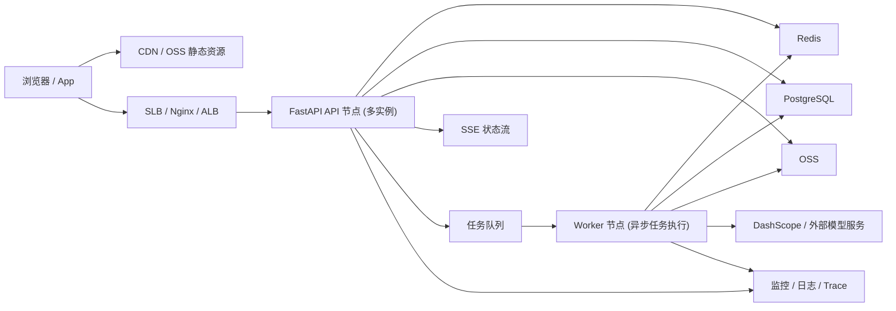

# 平台 1000 在线承载转型路线图

## 标题

在不做大爆炸重写的前提下，把当前平台逐步演进为适合 Linux 服务器生产部署、可稳定承载 1000 在线用户的架构。

## 背景

- 当前平台的主能力已经可用，但核心状态仍大量依赖 JSON 文件、文件锁、目录扫描与进程内后台任务。
- 当前生产启动虽然已经支持 Gunicorn，但任务执行、会话校验、轮询放大、静态资源承载仍以“单机应用进程”为中心。
- 开发环境可以继续是 macOS，但生产环境必须按 Linux 服务器来设计，不能把开发机行为当成生产假设。
- 平台当前的真实瓶颈不只是 CPU，而是：
  - 会话/配置/业务数据的文件 I/O 和锁竞争
  - `asyncio.create_task` 进程内任务模型
  - 前端高频轮询带来的状态查询放大
  - API 进程同时承担静态资源和任务协调
  - 缺少面向扩容的统一观测、压测与回滚门禁

## 目标

- 以“小步可回退”的方式完成架构转型，每一步都可单独验证并合并到 `main`。
- 建立面向 Linux 服务器的生产拓扑，而不是围绕 macOS 开发机做推演。
- 支持“1000 在线用户”场景下的稳定 API 访问、任务提交、任务查询与素材访问。
- 降低状态查询放大、跨 worker 不一致、单进程任务丢失等风险。
- 为后续继续扩容到多节点、弹性伸缩、托管数据库/缓存打下边界清晰的基础。

## 非目标

- 本轮不追求一次性改成微服务。
- 本轮不把所有旧 JSON 数据一次性整体迁走。
- 本轮不默认引入 Kubernetes 作为首个生产形态。
- 本轮不把图片/视频二进制素材放进数据库。

## 用户流 / 角色

- 角色：
  - 终端用户：登录、创建项目、提交生成任务、查看状态、下载素材
  - 运维/开发者：部署、扩缩容、查看日志和指标、执行回滚
  - 平台管理员：配置模型密钥、限流策略、任务配额
- 关键路径：
  - 登录成功且 token 在多实例下行为一致
  - 创建/提交任务后能立即得到可追踪任务 ID
  - 任务状态不依赖高频轮询才能感知进度
  - 素材上传/下载不占用过多 API 进程资源
  - 部署到 Linux 服务器后可重复启动、可观测、可回滚
- 失败呈现：
  - 用户得到结构化错误与排队/限流提示
  - 运维能看到哪一层失败：边缘层、API、队列、Worker、数据库、缓存、厂商调用

## 状态与数据契约

- 当前状态分层：
  - 用户/会话：文件
  - 配置：文件
  - 业务实体：文件
  - 长任务：文件 + 进程内协程
  - 素材：本地目录 / OSS
- 目标状态分层：
  - 会话、热点缓存、分布式限流、队列：Redis
  - 核心业务实体、任务索引、迁移元数据：PostgreSQL
  - 大文件素材：OSS + CDN
  - 长任务执行：独立 Worker 进程
  - API 状态推送：SSE 优先，保留轮询作为降级路径
- 兼容策略：
  - 前期允许 JSON 与 PostgreSQL 混合存在
  - 新读写先经 repository / gateway 抽象层
  - 通过双写、回填、读切换逐步迁移，而不是停机大切换

## API / Schema / 表单约束

- API 层只做：
  - 鉴权
  - 参数校验
  - 同步读请求
  - 入队与任务状态查询
- Worker 层负责：
  - 调用 DashScope / OSS
  - 重试、退避、幂等
  - 更新任务状态机
- 前端约束：
  - 状态展示优先接 SSE，轮询仅作为兜底
  - 文件上传优先走签名直传，不再默认经应用中转
  - 错误提示必须区分：参数错误、排队、限流、厂商失败、系统失败

## 实现边界

- 前端负责：
  - 任务提交体验、状态订阅、错误反馈、降级兜底
- 后端 API 负责：
  - 统一对外契约、鉴权、排队、查询、权限隔离
- Worker 负责：
  - 真正的长任务执行和外部依赖调用
- 边缘层负责：
  - TLS、静态资源、反向代理、超时、压缩、CDN 接入
- 基础设施负责：
  - PostgreSQL、Redis、对象存储、监控系统

## 可观测性

- 所有步骤都必须补齐：
  - 请求 ID / 任务 ID / 用户 ID / provider request_id
  - API P50/P95/P99 延迟
  - 队列长度、Worker 并发占用
  - 任务成功率、重试次数、失败分类
  - Redis / PostgreSQL 连接池与错误率

## 验收标准

- 方案层验收：
  - 每一步有明确目标、推荐方案、备选方案、验证方法、回滚方式
  - 每一步都能独立合并，不要求等待“最终大版本”
- 技术层验收：
  - 每一步上线前都有自动化验证和最小手工验证
  - 每一步上线后都能在 Linux staging 环境复验
- 组织层验收：
  - 每一步在实现前都要先讨论确认，再进入代码改造

## 文档更新

- 本路线图配套以下文档：
  - `docs/adr/ADR-0002-server-grade-scalability-architecture.md`
  - `docs/specs/2026-04-step-00-capacity-baseline-and-slo.md`
  - `docs/specs/2026-04-step-01-linux-runtime-and-edge.md`
  - `docs/specs/2026-04-step-02-redis-session-cache-rate-limit.md`
  - `docs/specs/2026-04-step-03-async-job-orchestrator.md`
  - `docs/specs/2026-04-step-04-postgres-domain-migration.md`
  - `docs/specs/2026-04-step-05-realtime-status-and-upload-offload.md`
  - `docs/specs/2026-04-step-06-observability-loadtest-and-release-gates.md`

## 目标工作负载模型

### 工作负载分级

- **W1：1000 在线，100~150 活跃操作用户**
  - 读请求为主
  - 任务提交较少
  - 适合作为最小生产目标
- **W2：1000 在线，200~300 活跃操作用户**
  - 中等频率任务提交
  - 明显依赖任务状态更新和素材访问
  - 适合作为推荐目标
- **W3：1000 在线且大量用户同时提交生成**
  - 本质上是“外部 AI 供应商配额与预算”问题
  - 平台可以排队承接，但不能承诺无等待地瞬时完成

### 当前确认目标

- 架构设计按 **W2** 打底
- 运维预案按 **W3 排队模式** 设计

## 目标生产拓扑（推荐）

## 实施顺序（推荐）

1. **Step 00：容量基线、SLO、压测口径先统一**
2. **Step 01：先把生产运行形态纠正为 Linux server-grade**
3. **Step 02：先去掉文件型会话/限流瓶颈，落 Redis**
4. **Step 03：再把长任务从 API 进程里拆出去**
5. **Step 04：再把核心业务状态逐步迁到 PostgreSQL**
6. **Step 05：再把高频轮询和上传中转压下去**
7. **Step 06：最后把观测、压测、发布门禁固化**

## 为什么按这个顺序

- 先统一容量口径，避免“没定义目标就改架构”。
- 先修正运行时和边缘层，再做数据/队列改造，能减少环境噪音。
- 先把会话、缓存、限流外置到 Redis，可以立即缓解多 worker 不一致。
- 先把长任务拆到 Worker，才能真正释放 API 进程。
- PostgreSQL 迁移最重，放在队列模型明确后更稳妥。
- SSE/直传收益很大，但要建立在任务状态源和权限模型更稳定之后。

## 分支与合并策略

- 当前实验分支：`codex/exp-scalability-roadmap-20260419`
- 推荐实践：
  - 实验分支只承载方案文档、原型探索和跨步骤上下文
  - 每个真正实施步骤再开短分支，例如 `codex/scale-step-02-redis-sessions`
  - 每一步验证通过后单独合并到 `main`
- 不推荐：
  - 把所有代码改动长期堆在一个实验分支里最后一次性合并

## 每一步都要讨论的固定问题

- 这一小步的收益是否足够大，值得先做？
- 这一小步是否引入新的运维复杂度？
- 这一小步的回滚是否简单？
- 这一小步是否改变现有用户体验或接口语义？
- 这一小步是否会阻塞后续步骤？

## 当前建议的讨论节奏

- 第一轮：确认总目标、目标负载、推荐生产拓扑
- 第二轮：只讨论 Step 00 和 Step 01
- 第三轮起：每轮只推进一个步骤，确认后再实现
